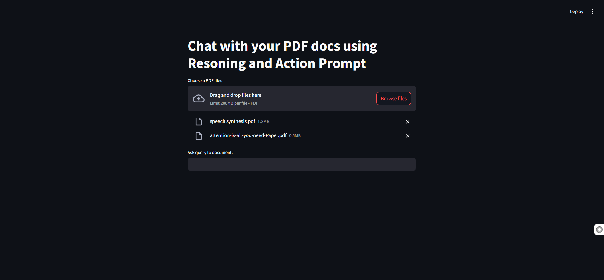
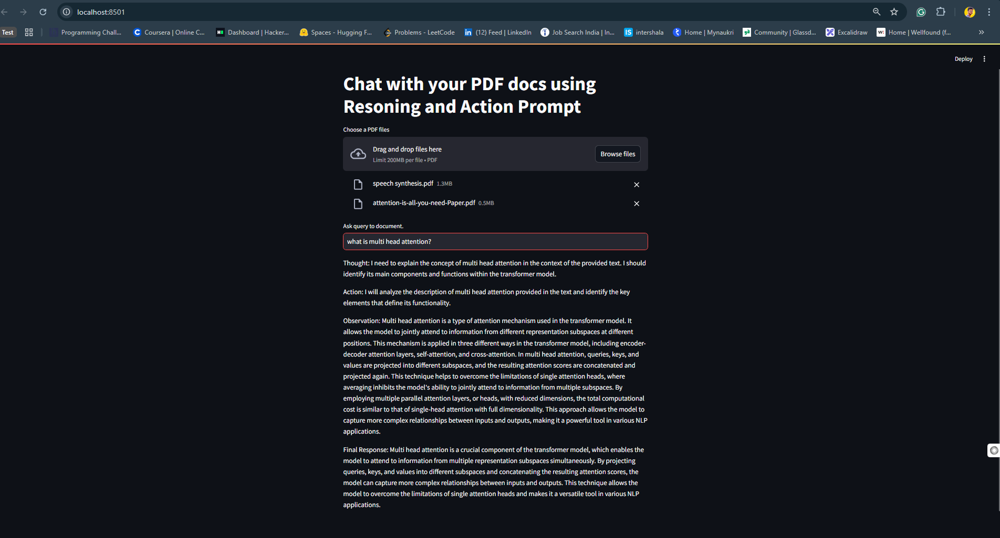

# Chat_PDF

This project is designed to extract and get information quickly without wasting time to read multiple large size PDFs.


### Key Features.

- Feature 1: Load multi-Large size documents.
- Feature 2: Created a Retrieval Augmented Generation Pipeline for documents.

---

### Technology used.

- **Language/Frameworks** : Python, Langchain, Streamlit

---

## Installation

Follow these steps to install and run the project locally:

### Prerequisites

Ensure that the following are installed on your system:

#### For Local Setup:

- **Python 3.11.6**: You can download it from [Python's official website](https://www.python.org/downloads/).
- **pip**: Python package installer (comes with Python).
- **git**: For cloning the repository.
- **API keys**: Check .env.example file to add your own api tokens.


### Local Setup

1. **Clone the Repository**

   First, clone the repository from GitHub to your local machine:

   ```bash
   git clone https://github.com/MohitWani/Chat_PDF.git
   ```

2. **Navigate to the Project Directory**

    ```bash
    cd Chat_PDF
    ```
 
3. **Create a Virtual Environment**

    ```bash
    python -m venv env
    env\Scripts\activate
    ```

4. **Install the Required Dependencies**

    install all required Python packages using pip:
    ```bash
    pip install -r requirements.txt
    ```

5. **Setup API TOKENS**

    Create .env file:

    //add your own API tokens use .env.example file for reference.
    ```bash
    touch .env


6. **Run the Application**

    Finally, run the application:

- For a Streamlit app:

    ```bash
    streamlit run app.py
    ```


#### RAG Input UI

---

